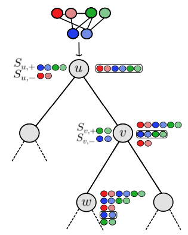

# TREE-G - Decision Trees with Dynamic Graph Features
TREE-Gs are decision trees specialized for graph data. They can be used for classificaiton, regression, vertex-labeling, graph-labeling, and edge-labeling.
The model is described in the paper [Decision Trees with Dynamic Graph Features](https://arxiv.org/abs/2207.02760)
TREE-G is highly recommended when learning over tabular features, and can outperform Graph Neural Networks on such tasks, as shown in the paper.
The library is Scikit compatible.



## Getting Started

Create a conda environment with the requierements.txt file:
```
$ conda create --name <env> --file requierements.txt
```
Run examples are found in the experiments directory. 
To run graph level experiments run:
```
$ python experiments/run_graph_experiments.py --exp_name=<dataset name>
```
The available datasets are:
* mutag
* proteins
* nci1
* dd
* enzymes
* imdbb
* imdbm
* ptcmr
* mutagenicity
* hiv

To run node level experiments run:
```
$ python experiments/run_node_experiments.py  --exp_name=<dataset name>
```
The available datasets are:
* cora
* citeseer
* pubmed
* arxiv

The depndencies to install via pip can be found in the requierements_pip.txt file


### IMPORTANT NOTE
The experiements folder uses a 3rd party library - starboost, which have a bug. To fix it, please change the following:
Line 124 of boosting.py in starboost site-packages files should be changed to: 
```
 y_pred[:, i] += self.learning_rate * direction[:, i]  
```
The same fix should be applied in line 179
/usr/local/lib/python3.8/dist-packages/starboost/

### Using Tree-Gs estimators
If you wish to use Tree-G as an estimator for your own algorithm, the data should be in a treeg-graph format.
To convert a pytorch-geometric graph to tree-graph, use for graph-level tasks:
```
from treeg.graph_treeg.graph_data_graph_level import GraphData
import treeg.graph_treeg.formater_graph_level as formatter

dataset = <your pytorch-geometric dataset>
formatter = DataFormatter(GraphData)
X, y = formatter.pyg_data_list_to_tree_graph_data_list(dataset)
X, y = np.array(X), np.array(y)
```

and for vertex-level tasks:
```
from treeg.graph_treeg.graph_data_node_level import GraphData
import treeg.graph_treeg.data_formetter_node_level.py as formatter

dataset = <your pytorch-geometric dataset>
graph, y_nodes = formatter.transductive_pyg_graph_to_tree_graph(dataset)
X = np.arange(dataset.data.num_nodes)
X_train, X_valid, X_test = X[dataset.data.train_mask], X[dataset.data.val_mask], X[dataset.data.test_mask]
y_train, y_valid, y_test = y_nodes[dataset.data.train_mask], y_nodes[dataset.data.val_mask], y_nodes[dataset.data.test_mask]
```


#### Cite
If you use this library, please cite:
```
@misc{https://doi.org/10.48550/arxiv.2207.02760,
  doi = {10.48550/ARXIV.2207.02760},
  
  url = {https://arxiv.org/abs/2207.02760},
  
  author = {Bechler-Speicher, Maya and Globerson, Amir and Gilad-Bachrach, Ran},
  
  keywords = {Machine Learning (cs.LG), Artificial Intelligence (cs.AI), FOS: Computer and information sciences, FOS: Computer and information sciences},
  
  title = {Decision Trees with Dynamic Graph Features},
  
  publisher = {arXiv},
  
  year = {2022},
  
  copyright = {Creative Commons Attribution 4.0 International}
}
```

### Contact
For any questions, please contact Maya Bechler-Speicher: mayab4 at mail dot tau dot ac dot il.